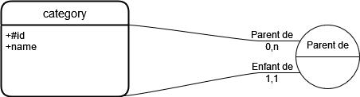

# API Category Manager

API de gestion de catégories

## Pré-requis

- OpenJDK 17 ou +
- Maven 3.8.1 ou +

## Build de l'application

A la racine du projet, exécuter la commande `mvn clean install` .

## Lancement en local

Exécuter la commande `mvn spring-boot:run` à la racine du projet pour lancer l'application en local.

## Base de données

Une base de donnée HSQLDB "in memory" est embarquée dans l'application.
Elle est créée au mancement de l'application et détruite lorsqu'on arrête l'application.

Elle ne contient qu'une seule table, la table 'category'.

Le modèle de données est le suivant :

On pourrait rajouter une table 'user' pour stocker les informations des utilisateurs à utiliser pour l'authentification (id, username, encrypted_password, role).

## Chargmement des données

Les catégories sont créées et chargées dans la base de donnée au lancement de l'application.
Elles sont générées par le DataPublisher, et insérées par batchs par le BatchLoader.

## Documentation API

Une [collection postman](src/main/resources/misc/CategoryManager.postman_collection.json)  est disponible avec les différentes requêtes possibles.